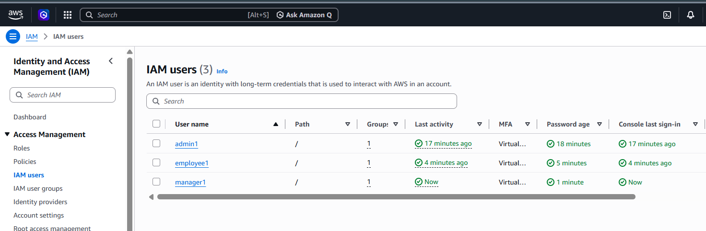
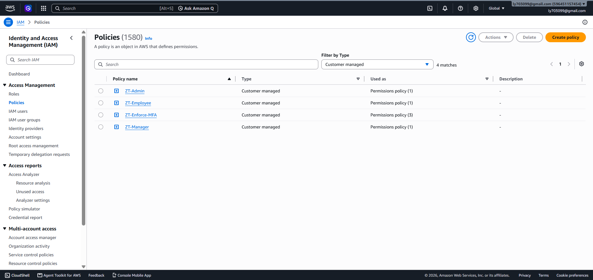
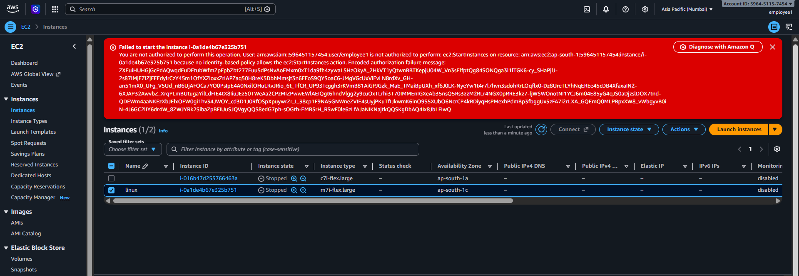

# Zero Trust Architecture for Enterprise Security (AWS)

A practical Zero Trust implementation on AWS: identity-first access (MFA + RBAC), least-privilege IAM policies, network micro-segmentation, and encryption at rest. Built as part of an internship minor project.

---

## 📌 Overview

Traditional perimeter security trusts anything inside the network. Zero Trust removes that assumption: **never trust, always verify**. This project builds a small AWS lab where every request is authenticated (MFA), authorized against least-privilege policies, restricted by network segmentation, and logged (CloudTrail).

Validated with an **insider-threat** simulation (low-privilege user attempting a restricted action) and a CloudTrail audit review. External RDP blocking is part of the network design; the live test was not executed.

---

## 📂 Repository Structure

```
├── Zero_Trust_Architecture_Report.pdf   # Full project report
├── role-permission-matrix.csv           # Role vs permission matrix
├── setup_iam.ps1                        # IAM setup (policies, groups, users)
├── check_baseline.ps1                   # Windows baseline check (from Project 1)
├── policies/                            # IAM policy JSON files
│   ├── 00-enforce-mfa.json
│   ├── 01-employee-policy.json
│   ├── 02-manager-policy.json
│   ├── 03-admin-policy.json
│   └── 04-ip-allowlist-deny.json
├── screenshots/                         # Test evidence
└── README.md
```

## 📄 Report Contents

| Section | Covers |
| --- | --- |
| Zero Trust Principles | Never trust/always verify, least privilege, assume breach |
| MFA + RBAC | Virtual MFA enforcement, role-based access for 3 roles |
| Framework Design | Identity verification, micro-segmentation, encryption |
| AWS Implementation | IAM, VPC + Security Groups, KMS, Windows VM hardening |
| Testing | Insider threat simulation, CloudTrail review, external threat (design) |
| Results | Access Denied evidence, CloudTrail logs |
| Recommendations | Next steps for production hardening |

## 🏗️ Architecture

| Layer | Control |
| --- | --- |
| Identity | IAM users in role groups, MFA enforced via deny-without-MFA policy |
| Authorization | Least-privilege custom JSON policies + explicit denies |
| Network | VPC, public/private subnets, Security Groups, RDP allow-listed to one IP |
| Data | KMS-encrypted S3 bucket and EBS volumes |
| Monitoring | CloudTrail event history reviewed for denied actions |

## 👥 Roles

| User | Role | Access |
| --- | --- | --- |
| employee1 | Employee | Read-only on `public/` and `employee/` data |
| manager1 | Manager | Read/write team data, start/stop tagged EC2, view audit logs |
| admin1 | Admin | Full lab admin with guardrails (cannot stop CloudTrail, delete keys) |

Full matrix: [role-permission-matrix.csv](role-permission-matrix.csv)

## 🛠️ Setup

Prereqs: AWS CLI v2 configured, placeholders replaced in `policies/*.json`
(`<BUCKET_NAME>`, `<REGION>`, `<ACCOUNT_ID>`, `<KMS_KEY_ID>`, `<YOUR_PUBLIC_IP>`).

```powershell
Set-ExecutionPolicy RemoteSigned -Scope Process
.\setup_iam.ps1
```

Then enable virtual MFA per user in the console. VPC, Security Groups, and KMS steps are documented in the report.

## 🧪 Tests

| Test | Expected | Result |
| --- | --- | --- |
| Sign-in with MFA | MFA code required | Observed |
| employee1 attempts restricted action | Access Denied | Observed |
| CloudTrail review | Denied event logged | Observed |
| RDP from non-allow-listed IP | Blocked by Security Group | Not executed (design only) |

## 📸 Screenshots

### Users with MFA enabled


### Group policies attached



### Insider threat: employee1 denied



## ✅ Recommendations

- Enforce MFA for every identity, including root
- Prefer IAM roles / temporary credentials over long-lived keys
- Restrict RDP to a VPN or Session Manager instead of public IPs
- Alert on CloudTrail denied events (CloudWatch + SNS)
- Review IAM permissions periodically (Access Analyzer)

## 👤 Author
Shakshi Sharma

**<YOUR NAME>**
